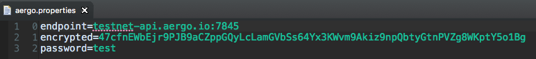

# Heraj Examples

A collection of examples using heraj

## Compatibility

- heraj : 1.2.1
- jdk : 7 or higher

## Usage

### Import

- Eclipse : Project Explorer -> Import -> Existing Gradle Project -> Select heraj-example -> Finish

### Setup aergokey

#### Create & Export Account

[aergo connect][https://chrome.google.com/webstore/detail/aergo-connect/iopigoikekfcpcapjlkcdlokheickhpc]

Create

-> Copy account address

Export

-> Copy exported account

#### Get aergo

[testnet faucet page](https://faucet.aergoscan.io/)

Paste created account address

#### Ready account

Fill encrypted in `hera/example/key/aergo.properties` with exported one

### Run

Just all main methods of each classes.

## Contribution

All java files should be formatted according to [Google's Java style guide](http://google.github.io/styleguide/javaguide.html).\
You can use checkstyle plugin for [eclipse](https://checkstyle.org/eclipse-cs/#!/) or [IntelliJ](https://plugins.jetbrains.com/plugin/1065-checkstyle-idea).\
Following style rule, do not hesitate to make pull requests for improvements.