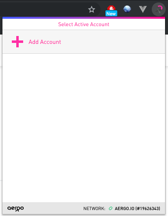
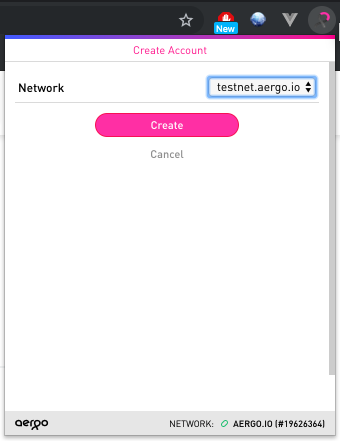
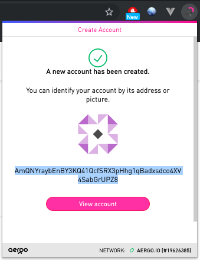
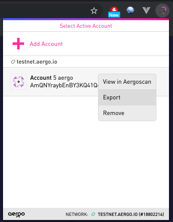
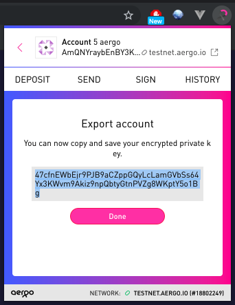
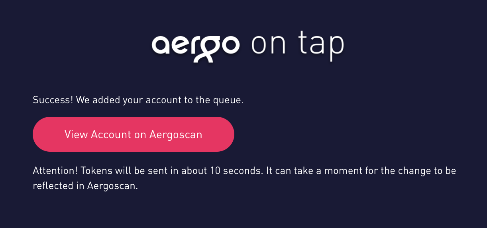
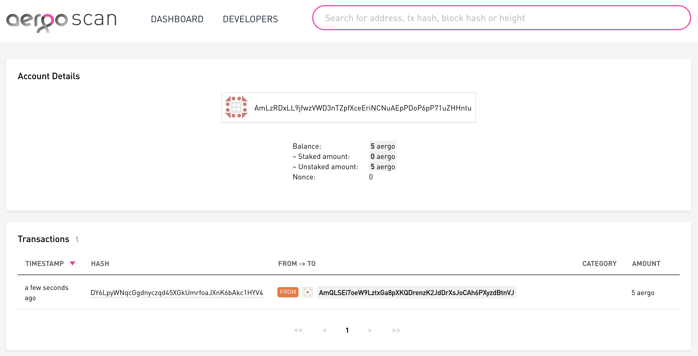
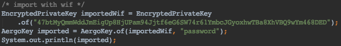

# Heraj Examples

A collection of examples using heraj

## Compatibility

- jdk : 7 or higher

## Usage

### Import

- Eclipse : Project Explorer -> Import -> Existing Gradle Project -> Select heraj-example -> Finish

### Prepare account in a testnet (Optional)

If you want examples to use in a testnet (testnet-api.aergo.io:7845), you have to prepare account with aergo.

#### Create & Export Account

[aergo connect][https://chrome.google.com/webstore/detail/aergo-connect/iopigoikekfcpcapjlkcdlokheickhpc]

Create

-> Copy account address

Export

-> Copy exported account

#### Get aergo

[testnet faucet page](https://faucet.aergoscan.io/)

Paste created account address

#### Ready account

Import encrypted key

## Contribution

All java files should be formatted according to [Google's Java style guide](http://google.github.io/styleguide/javaguide.html).\
You can use checkstyle plugin for [eclipse](https://checkstyle.org/eclipse-cs/#!/) or [IntelliJ](https://plugins.jetbrains.com/plugin/1065-checkstyle-idea).\
Following style rule, do not hesitate to make pull requests for improvements.